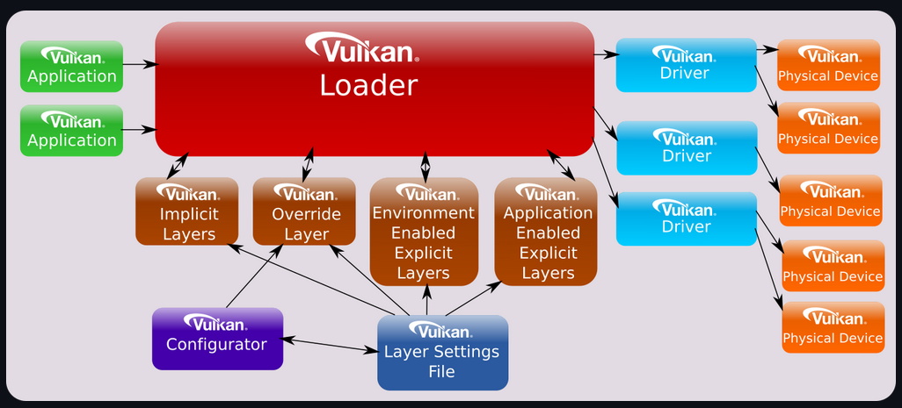

# Vulkan



The vulkan API can be organized into two groups:
- Instance-specific
- Device-specific

Extensions to vulkan are similarly associated on these groups. "Instance extensions" are primairly composed of 
"instance functions".

## Loader
A vulkan application interfaces directly with the [_Loader_](https://github.com/KhronosGroup/Vulkan-Loader/blob/main/docs/LoaderInterfaceArchitecture.md).
Then, through various layers inside vulkan it eventually deligates it work to a driver, which in turn controls one
or more physical devices.

## Object Model
Vulkan exposes several _objects_ through _opaque_ handles. Under the hood they can be anything; an integer, pointer,
anything. Opaque meaning it's a black box, and you can't interact with it directly; black box. However, you can
interact using/passing them. The scope of actions/operations is determined by the object passed as the first
parameter in a call.

## Layers
TODO https://github.com/KhronosGroup/Vulkan-Loader/blob/main/docs/LoaderInterfaceArchitecture.md#layers

## Dispatch Tables
TODO https://github.com/KhronosGroup/Vulkan-Loader/blob/main/docs/LoaderInterfaceArchitecture.md#dispatch-tables-and-call-chains

## Groups
### Instance-specific
A Vulkan instance `VKInstance` is a high-level construct used to provide vulkan system-level information and
functionality.

#### Objects
Several objects are associated to a vulkan instance, such as:
- `VKInstance`
- `VKPhysicalDevice`
- `VKPhysicalDeviceGroup`

#### Functions / Methods
Several functions are associated to a vulkan instance. These functions require the the instance object as a
parameter, or nothing at all. Some are:
- `vkEnumerateInstanceExtensionProperties`
- `vkEnumeratePhysicalDevices`
- `vkCreateInstance` 
- `vkDestroyInstance`

These functions may be queried using `vkGetInstanceProcAddr`.

### Device-specific
A Vulkan device `VKDevice` is a logical identifier associated with a physical device `VKPhysicalDevice` using
a particular driver.

#### Objects
Several objects are associated to a device:
- `VKDevice`
- `VKQueue`
- `VKCommandBuffer`

#### Functions / Methods
Several functions are associated to a device. These functions require the the device object as a
parameter, or nothing at all. Some are:
- `vkQueueSubmit`
- `vkBeginCommandBuffer`
- `vkCreateEvent`

These functions may be queried using (ideally) `vkGetDeviceProcAddr`. 

## Loader API
`vk.SetGetInstanceProcAddr(procAddress)` sets the _loader_/_getter_ to 
use for non-core vulkan functionality.

Vulkan's loader libary directly exports all core **Vulkan entry points**
and **Window System Interface (WSI)** entry-points. The provided API
can be used to load the desired functionality, _seemingly so that only 
necessary functionality is loaded, another optimization_

Specifically mentioned in the 

### Unclear
- What's a dispatch table? C thing?

## Sources
- https://github.com/KhronosGroup/Vulkan-Loader/blob/main/docs/LoaderInterfaceArchitecture.md

```go
vk.SetGetInstanceProcAddr(glfw.GetVulkanGetInstanceProcAddress())
```
